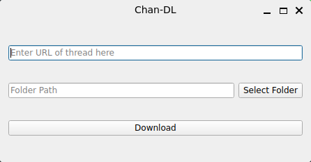

# Chan-DL

4chan thread downloader based on PySide6 (QT)

## Why does this exist?

Because there's no way to download the entire thread in HTML with both the thumbnails  and full resolution images or videos for offline viewing.

## Roadmap
- 🚧 **Modular system**: So the end user will be able to write their own classes based on the API
- 🚧 **Other Imageboards**: Add support for other imageboards

## Requirements

- Windows 10 or Linux

## Installation

### Windows | Linux

1. Download the latest release for your system from the [Releases](https://github.com/regularentropy/chan-dl/releases) page.
2. Extract the archive and run the `chan-dl` executable.

## Contributing
Pull requests are welcome. For major changes, open an issue first to discuss what you want to change.

Build requirements:
- uv (https://docs.astral.sh/uv/)
- Latest version of Python

## License

[GPLv3](LICENSE) © 2026 regularentropy